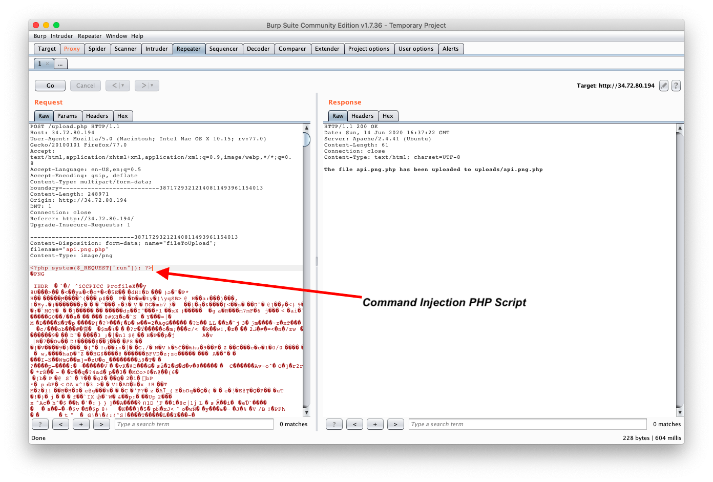
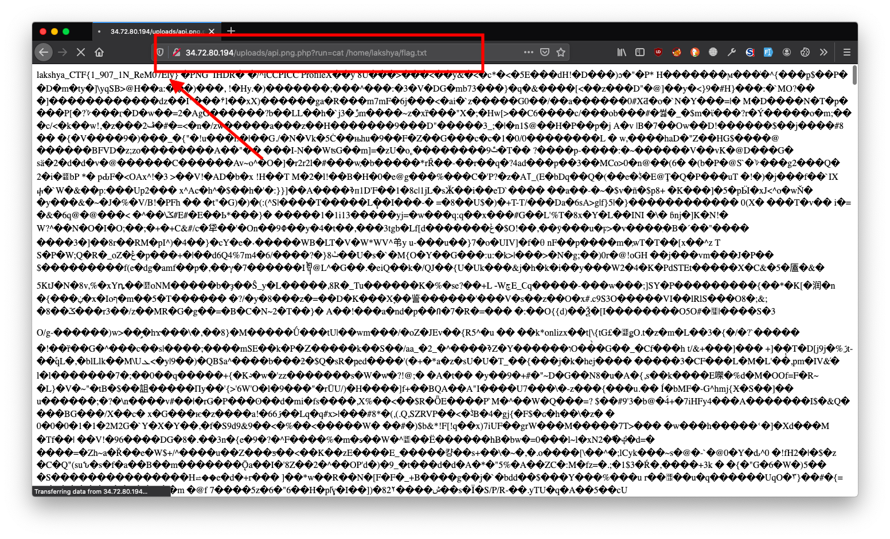

## Bypass


The website is a PHP photo upload server. Performing an NMap scan using ```nmap -sV -sC -oA bypass machine-ip``` shows only two ports open. One of them is HTTP and the other is SSH.

The goal here is to upload a malicious PHP script that can be executed by the PHP server. Since the file upload server allows the upload of image files, Burp Suite's Repeater feature is used to upload a PHP script on the server. 

</img>

We use this uploaded payload to run commands on the machine. 

</img>

Using the user flag as the password, SSH into the machine with ```ssh lakshya@machine-ip```. 
